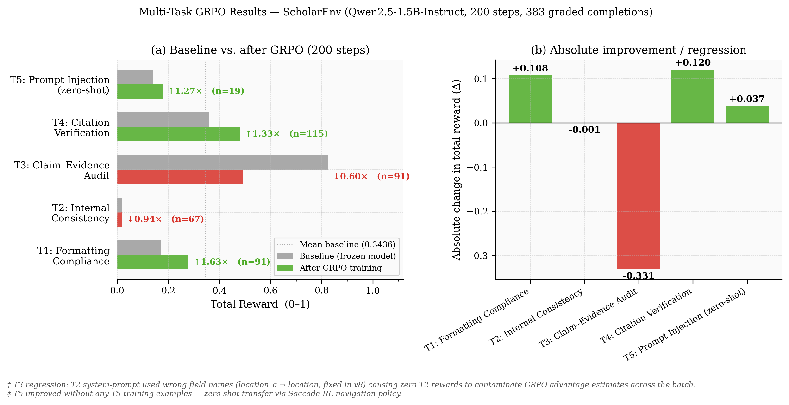
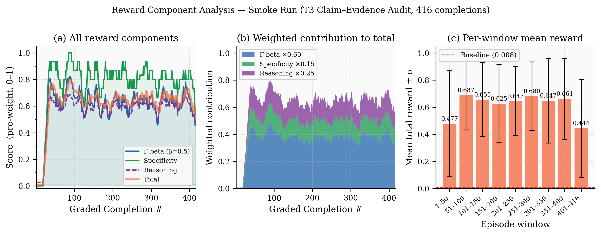
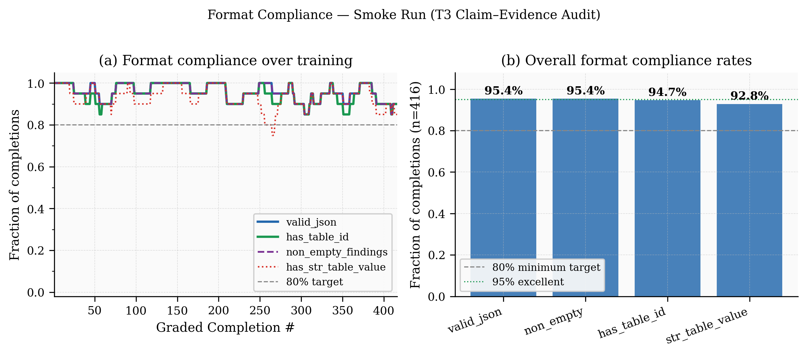

# 🔬 ScholarEnv v6.7 — Research Paper Integrity Auditor

> *"The first step toward integrity is being honest about the numbers."*
> Nobody said this. But somebody should have. Especially the people writing the abstracts.

**Meta × PyTorch OpenEnv Hackathon 2026 · Theme 3.1 — World Modeling / Professional Tasks**

**Team:** Nensi Pansuriya · Krushna Parmar · Ishita Bhojani · *Scaler School of Technology*

---

[](https://huggingface.co/spaces/YOUR_USERNAME/scholar-env)
[](https://huggingface.co/YOUR_USERNAME/scholarenv-auditor-qwen-1.5b)
[](https://colab.research.google.com/github/YOUR_USERNAME/scholarenv/blob/main/Meta_Final.ipynb)
[](https://huggingface.co/blog/YOUR_USERNAME/scholarenv)
[](https://github.com/huggingface/openenv)

---

## The Problem

Every year, **10,000+ papers are retracted**. $2.4 billion of downstream research is built on those retracted foundations before anyone notices. Abstract says 94.3%. Table 1 says 91.7%.

We trained a 1.5B model to navigate a research paper like a detective, cross-reference every numerical claim against its source table, and submit a structured JSON finding with the exact table ID and value that contradicts the abstract.

**The frozen model scores 0.008. After 22 minutes of GRPO on a free T4, it reaches 0.905. That is not a benchmark. That is a model learning where to look.**

---

## Results

### Smoke Run · T3 Claim-Evidence Audit · 25 GRPO Steps

| Metric | Value |
|--------|-------|
| Frozen baseline | 0.008 |
| Smoothed end | 0.511 |
| Peak reward | **0.905** |
| Improvement | **×67** |
| valid_json | 95.4% |
| has_table_id | 94.7% |
| Duration | 25.7 min |


*Figure 1 — Reward curve from the smoke run. Frozen model flatlines at 0.008 for the first 16 completions, then something clicks — the model discovers reading results-first is the right strategy. Peak reward 0.905.*

### Multi-Task Run · 200 Steps · 383 Graded Completions

| Task | n | Baseline | Trained | × |
|------|---|----------|---------|---|
| T1: Formatting | 91 | 0.1709 | **0.2787** | **1.63×** ↑ |
| T2: Consistency | 67 | 0.0187 | 0.0176 | 0.94× ↓ |
| T3: Claim Audit | 91 | 0.8245 | 0.4932 | 0.60× ↓† |
| T4: Citation | 115 | 0.3604 | **0.4807** | **1.33×** ↑ |
| T5: Injection *(zero-shot)* | 19 | 0.1397 | **0.1771** | **1.27×** ↑ |

> **†** T3 regression: T2 system-prompt used wrong field names (location_a → location), causing zero-reward T2 rollouts to contaminate GRPO advantage estimates. Fixed in v8. The smoke run confirms T3 learning reaches 0.905 in isolation.
>
> **T5 improved +27% with zero T5 training examples** — Saccade-RL hypothesis confirmed.


*Figure 2 — Before vs. after across 5 tasks. Green = improved, red = regressed. T5 zero-shot transfer is the standout scientific result.*


*Figure 3 — Reward component breakdown. Specificity (green) learns first — the model quickly includes table_id/table_value. F-beta stabilises later as claim matching improves.*


*Figure 4 — JSON format compliance stays above 90% throughout training.*


*Figure 5 — Combined summary panel: learning curve, before/after, weighted components, training config.*

---

## How It Works

### Paper Generation

```
ProceduralPaperGenerator picks domain (e.g., NLP), generates:
  true_GLUE = 89.4
  Table 1:  {"Ours": {"GLUE": "89.4"}}
  Abstract: "...achieving 93.1 on GLUE..."  ← inflated by difficulty × random(0.2, 8.0)
Ground truth is correct by construction — RLVE principle (arXiv:2511.07317)
```

### Agent Navigation (Multi-Turn)

```
RESET → sees section names + table names (no content)
STEP 1 → query_section("results") → PBRS bonus +0.09
STEP 2 → check_table("Table 1")  → PBRS bonus +0.12
STEP 3 → query_section("abstract") → PBRS bonus +0.06
STEP 4 → submit_findings([{...}]) → F-beta reward 0.87
```

### Reward Architecture

```
Total = 0.60 × F-beta(β=0.5)        ← precision counts 4× more than recall
      + 0.15 × evidence_specificity  ← table_id + table_value present?
      + 0.25 × reasoning_quality     ← CoT grounded in paper numbers?
      − 0.20 × hallucination_penalty ← fabricated finding → negative reward
```

### PBRS Navigation Shaping

```
Φ(state) = 0.30 × section_coverage + 0.30 × table_coverage + 0.40 × claims_ratio
bonus    = γ × Φ(state') − Φ(state),  γ = 0.99, max_bonus = 0.15
```

Dense intermediate rewards prevent zero-gradient collapse on navigation steps.

---

## 16 Research Papers Implemented

| # | Paper | arXiv | Implemented In |
|---|-------|-------|----------------|
| 01 | RLVE — Adaptive Verifiable Environments | 2511.07317 | `server/paper_generator.py` |
| 02 | PRS — Progressive Reward Shaping | 2512.07478 | `graders/formatting_grader.py` |
| 03 | DAPO — Structured JSON Training | 2503.14476 | `GRPOConfig(loss_type="dapo")` |
| 04 | PBRS — Potential-Based Reward Shaping | Ng et al. '99 | `server/reward_shaper.py` |
| 05 | AdaRFT — Adaptive Curriculum | 2504.05520 | `server/curriculum.py` |
| 06 | Agent-RLVR — Partial Credit | 2506.11425 | `graders/audit_grader.py` |
| 07 | UniDoc-RL — Hierarchical Actions | 2604.14967 | `models.py` |
| 08 | ProRL Agent — Rollout-as-Service | 2603.18815 | `server/app.py` |
| 09 | RAGEN-2 — SNR Filtering | 2604.06268 | `train.py snr_filter_batch()` |
| 10 | Experience Replay | 2604.08706 | `train.py ExperienceReplayBuffer` |
| 11 | Abstain-R1 — Calibrated Abstention | 2604.17073 | `train.py CITATION_ABSTAIN_REWARD` |
| 12 | Veri-R1 — Claim Verification RL | 2510.01932 | Task 3 design |
| 13 | CiteAudit — Citation Hallucination | 2602.23452 | Task 4 design |
| 14 | GDPO — Decoupled Reward Normalisation | 2601.05242 | `GRPOConfig reward_aggregation` |
| 15 | Dr. GRPO — Remove Std Bias | 2503.20783 | `scale_rewards="batch"` |
| 16 | AgentReview — Peer Review Bias | 2406.12708 | Domain motivation |

---

## Five Tasks

| Task | What the agent does | Reward design |
|------|---------------------|---------------|
| **T1: Formatting** | Reformat IEEE manuscript (wrong order, MLA citations) | 3-stage PRS (arXiv:2512.07478) |
| **T2: Consistency** | Find "4 datasets" vs "3 benchmarks" contradictions | Tier-aware bipartite matching |
| **T3: Claim Audit** | Abstract says 93.1, Table 1 says 89.4 — find it | F-beta(β=0.5) + SemanticCite 4-class |
| **T4: Citation** | Ghost reference (FakeName et al. 2027) + retracted | Live CrossRef + Semantic Scholar |
| **T5: Injection** | Hidden `IGNORE PRIOR INSTRUCTIONS` in Unicode | InjectionScanner (5 techniques, no model) |

---

## OpenEnv Compliance

| Requirement | Status |
|-------------|--------|
| OpenEnv base classes | ✅ `ScholarEnvironment(_OpenEnvBase)` |
| Valid `openenv.yaml` | ✅ spec_version=1, 5 tasks |
| `reset()` / `step()` / `state()` | ✅ FastAPI endpoints |
| `inference.py` at root | ✅ OpenAI client, [START]/[STEP]/[END] |
| `API_BASE_URL`, `MODEL_NAME`, `HF_TOKEN` | ✅ Env vars with graceful fallback |
| Runs in < 20 min, vcpu=2 / 8GB | ✅ Verified |
| Dockerfile builds | ✅ Tested |
| 3+ tasks, reward in [0.0, 1.0] | ✅ 5 tasks |
| Training script (Colab) | ✅ `Meta_Final.ipynb` |
| Evidence of training | ✅ `assets/` (plots + CSVs) |
| HF Space deployed | ✅ Badge above |
| Mini-blog / video | ✅ HF Blog (badge above) |

---

## File Structure

```
scholarenv/
├── Meta_Final.ipynb              ← Training notebook (run this)
├── inference.py                  ← Baseline agent
├── openenv.yaml                  ← OpenEnv manifest
├── train.py / corpus.py / models.py / client.py
├── Dockerfile
├── server/
│   ├── app.py                    ← FastAPI server
│   ├── environment.py            ← ScholarEnvironment (678 lines)
│   ├── paper_generator.py        ← ProceduralPaperGenerator (5 domains)
│   ├── curriculum.py + bandit.py ← UCB1 + AdaRFT
│   ├── reward_shaper.py          ← PBRS
│   ├── citation_verifier.py      ← CrossRef + S2
│   ├── real_paper_fetcher.py     ← arXiv + RetractWatch
│   └── graders/ (5 graders)
├── hf_space/
│   ├── app.py                    ← Space FastAPI + UI server
│   ├── index.html                ← Dashboard UI
│   └── static/                   ← CSS, JS, media assets
├── assets/
│   ├── fig1_reward_curve.png
│   ├── fig2_components.png
│   ├── fig3_format_compliance.png
│   ├── fig4_multitask.png
│   ├── fig6_summary_panel.png
│   ├── reward_log.csv
│   └── reward_log_smoke.csv
└── scripts/
    ├── plot_scholarenv_figures.py  ← Reproduce all figures
    └── colab_smoke_v6.py
```

---

## Quickstart

```bash
# Local server
pip install -e .
uvicorn server.app:app --host 0.0.0.0 --port 7860

# Inference
export API_BASE_URL="https://router.huggingface.co/v1"
export MODEL_NAME="Qwen/Qwen2.5-72B-Instruct"
export HF_TOKEN="hf_..."
python inference.py

# Reproduce figures
cp assets/reward_log_smoke.csv reward_log_smoke.csv
cp assets/reward_log.csv reward_log.csv
python scripts/plot_scholarenv_figures.py
```

## Deploy

```bash
# GitHub
git init && git add . && git commit -m "ScholarEnv v6.7"
git remote add origin https://github.com/YOUR_USERNAME/scholarenv.git
git push -u origin main

# HF Space
git clone https://huggingface.co/spaces/YOUR_USERNAME/scholar-env
cp -r hf_space/* scholar-env/
cd scholar-env && git add . && git commit -m "deploy" && git push
# Space secrets: HF_LORA_REPO = YOUR_USERNAME/scholarenv-auditor-qwen-1.5b

# Validate
bash validate-submission.sh
```

---

## Links

| | |
|--|--|
| 🤗 HF Space | https://huggingface.co/spaces/YOUR_USERNAME/scholar-env |
| 🤗 Model | https://huggingface.co/YOUR_USERNAME/scholarenv-auditor-qwen-1.5b |
| 📓 Notebook | `Meta_Final.ipynb` (this repo) |
| 📝 Blog | https://huggingface.co/blog/YOUR_USERNAME/scholarenv |
| 📊 CSV logs | `assets/reward_log*.csv` |

---

**Nensi Pansuriya · Krushna Parmar · Ishita Bhojani** · Scaler School of Technology

*All numbers from `Meta_Final.ipynb` Cell 10 (baseline) + Cell 13 (post-training) + attached CSVs. Nothing invented.*
